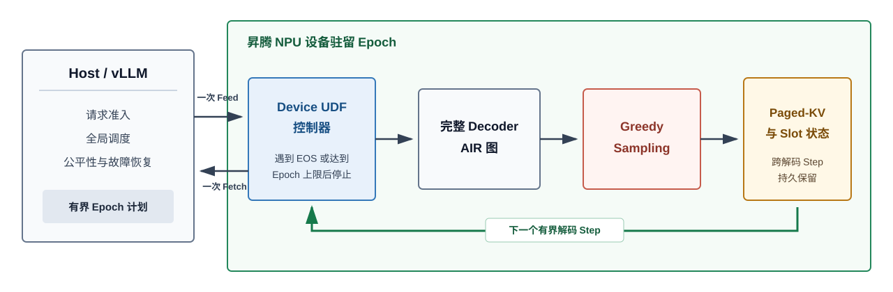

# Cruise

**简体中文** | [English](README_EN.md)

**通过设备驻留的解码 Epoch，消除逐 Token 的 Host 往返。**

Cruise 是面向昇腾 NPU 的研究原型。它利用 DataFlow Device UDF，将 LLM
解码过程中对延迟最敏感的内层控制循环下沉到设备侧。Host 仍然负责请求准入、
全局调度、公平性与故障恢复；固定批次完成准入后，设备可以连续执行一个有界的
decoder epoch，在设备侧更新 Paged-KV 状态、执行 greedy sampling，并在遇到 EOS
或达到 epoch 上限后再返回 Host。

Cruise 探索的是单次图重放之上的控制边界：图执行优化消除了单次模型执行内部的
逐算子下发开销，而 Cruise 进一步消除有界解码迭代之间反复发生的 Host 协调。

> Cruise 目前是实验性系统研究原型，并非生产级推理服务。现阶段支持范围经过
> 明确约束，不应将实验结果外推到未验证的工作负载。

## 系统架构



当前主线实现来自 **Attempt 74**，已经具备以下能力：

- 面向固定形状 resident epoch 的 vLLM V1 scheduler contract；
- 由 DataFlow 持有模型与 KV 状态的专用 worker；
- EngineCore 到 native sidecar 的执行路径，每个 epoch 只进行一次请求与响应；
- B=4 的完整 Qwen2.5-7B decoder step，以及设备侧 greedy sampling；
- 持久化 Paged-KV、active-row mask、block table、slot mapping、row generation，
  以及跨 epoch 的安全行复用；
- 根据请求剩余预算，在 K=1、2、4、8 中选择有界 epoch 长度；
- 设备侧 EOS/最大步数终止，并将逐请求执行账目返回 vLLM；
- 执行前合法性校验与输入状态保持不变的 fallback 状态码；
- 最小化的 8 输入/2 输出 Host-UDF ABI；早期版本为 10 输入/10 输出，内部
  decoder ABI 仍保持 9 输入/4 输出不变；
- 对日志大小、marker-protected scratch、根盘剩余空间和清理流程的存储保护。

已经通过的多 epoch cohort 为 `A -> [A,B] -> [A,C]`：请求 A 始终保留原有 row
和 KV 状态；B 使用第二个 row；B 离开后，C 通过新的 generation 安全复用该 row。
Attempt 74 的严格实验门槛参见 [PROTOCOL.md](PROTOCOL.md)。

## 当前证据

完整 decoder 的 G4 实验在冻结工作负载下实现了 Host/Device token 与状态的精确
一致，并将 K 次 Host 提交缩减为一组 DataFlow Feed/Fetch。最终的 blocked-ABBA
B=4 实验在 K=2、4、8 时分别得到 1.55x、3.56x 和 5.36x 的配对中位加速；每个
K 的 15 组配对样本均由 Device 路径胜出。这组测量早于最小 ABI，完整结果与
claim boundary 记录在
[`history/attempts/g4/G4-STATUS-20260724.md`](history/attempts/g4/G4-STATUS-20260724.md)。

Attempt 74 的源码约束和本地 ABI 测试已经通过。但由于共享 NPU 和根盘存储的
readiness gate 未能提供干净的正式运行窗口，最终的逐 epoch runtime-copy 实验尚未
完成。因此，本项目目前只报告逻辑 ABI payload 的缩减，不宣称已经证明物理
H2D/D2H 传输字节数同比下降。

## 支持边界

当前经过验证的环境与工作负载为：

- Ascend 910B2、CANN 9.0.0，并具备 DataFlow Device UDF 支持；
- Qwen2.5-7B-Instruct，TP=1、PP=1；
- vLLM V1 同步调度；
- one-token prompt 后进入 decode；
- 一个静态 B=4 图，通过 inactive-row mask 支持不足四路的批次；
- greedy sampling、有界 epoch，以及每个 row 固定两个 block 的 KV 布局。

Cruise 尚未证明通用 prefill、continuous batching、任意 sampling、speculative
decoding、preemption、cancellation、LoRA、TP/PP、多卡协调或 API server 性能。
这些是后续研究门槛，而不是可以忽略的兼容性假设。

## 仓库结构

| 路径 | 用途 |
|---|---|
| `src/vllm_ascend_resident_epoch/` | vLLM scheduler、worker、contract 与 backend 接入 |
| `controller/` | 当前 Device UDF 控制器 |
| `controller-old/` | 为受控 ABI 对照保留的旧版控制器 |
| `native/` | sidecar、bridge、AIR relocation 与 runtime-copy tracing |
| `config/` | DataFlow 与 graph 配置模板 |
| `tests/` | 源码约束与集成单元测试 |
| `storage_guard/` | 根盘空间、scratch、日志与清理保护 |
| `experiments/synthetic-p0/` | 最初的 synthetic feasibility 实验 |
| `history/attempts/` | Attempt 41-73 以及 G4 阶段的纯源码快照 |
| `docs/` | 项目演进与仓库存储策略 |
| `scripts/audit_repository.py` | 大文件、生成物、主机名与敏感信息审计 |

## 本地检查

以下轻量 contract 与结果验证测试不依赖 NPU、PyTorch 或 vLLM：

```bash
python -m pip install pytest
python -m pytest -q \
  tests/test_abi_measurement.py \
  tests/test_contract.py \
  tests/test_engine_core_result_verifier.py \
  tests/test_multi_epoch_result_verifier.py
python scripts/audit_repository.py
python verify_minimal_abi_source.py . \
  --baseline-source history/attempts/vllm-integration-attempt73-multi-epoch-cohort
```

该子集目前包含 24 项测试。完整的 38 项测试还需要冻结版本的 PyTorch、vLLM 和
vLLM-Ascend 环境；native 执行还需要实验协议指定的 Ascend/DataFlow 工具链、
decoder AIR 与外部权重。模型生成物和原始测量数据不会存入本仓库。

## 复现硬件实验

`run_attempt74.sh` 是冻结的实验驱动脚本。它依赖 `PROTOCOL.md` 中定义的受保护
服务器布局，将所有生成物暂存到带 marker 的 `/dev/shm` scratch 中，在加载模型前
检查 NPU 与存储 readiness，并且只在根盘保留精简证据。如需适配新的路径，应创建
一个明确版本化的新实验；直接修改冻结脚本会破坏与原实验的可比性。

## 项目演进

源码档案记录了项目从 synthetic recurrence、完整 decoder 到 vLLM 集成的完整
演进过程，简要阶段划分参见
[docs/PROJECT_HISTORY.md](docs/PROJECT_HISTORY.md)。历史目录只用于保存研究来源，
不作为当前维护的 release branch。

暂定论文题目：

> **Cruise: Eliminating Per-Token Host Round Trips with Device-Resident Decode Epochs**
