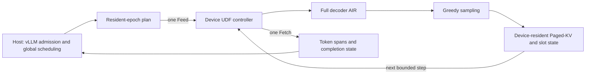

# Cruise

[简体中文](README.md) | **English**

**Eliminating per-token Host round trips with device-resident decode epochs.**

Cruise is a research prototype for Ascend NPUs that moves the
latency-sensitive inner loop of LLM decoding into a DataFlow Device UDF. The
Host still owns admission, global scheduling, fairness, and recovery. Once a
fixed batch has been admitted, the device can execute a bounded epoch of
decoder steps, update Paged-KV state, perform greedy sampling, and stop on EOS
or an epoch bound before returning to the Host.

The project explores a control boundary above single-graph replay: graph
execution removes per-operator launch overhead, while Cruise removes repeated
Host coordination between a bounded number of decode iterations.

> Cruise is an experimental systems prototype, not a production inference
> server. Its current support envelope is intentionally narrow and explicit.

## Architecture



The active implementation is the former **Attempt 74** snapshot. It provides:

- a vLLM V1 scheduler contract for fixed-shape resident epochs;
- a dedicated worker that leaves model and KV ownership with DataFlow;
- an EngineCore-to-native-sidecar path with one request/response per epoch;
- a B=4 full Qwen2.5-7B decoder step with device-side greedy sampling;
- persistent Paged-KV state, active-row masks, block tables, slot mappings,
  row generations, and safe row reuse across epochs;
- bounded epoch lengths selected from K=1,2,4,8 within the request budget;
- EOS and maximum-step termination with per-request accounting returned to
  vLLM;
- pre-execution validation and input-preserving fallback status codes;
- a minimal 8-input/2-output Host-UDF ABI, reduced from the earlier 10/10
  boundary while retaining the internal 9-input/4-output decoder ABI;
- storage guards for bounded logs, marker-protected scratch, free-space
  admission, and cleanup.

The accepted multi-epoch cohort is `A -> [A,B] -> [A,C]`: request A retains its
row and KV state, B occupies a second row, and C safely reuses B's row with a
new generation. See [PROTOCOL.md](PROTOCOL.md) for the exact Attempt 74 gate.

## Current Evidence

The full-decoder G4 experiments established exact Host/Device token and state
agreement for the frozen workload and reduced K Host submissions to one
DataFlow Feed/Fetch pair. The final blocked-ABBA B=4 study reported median
paired speedups of 1.55x, 3.56x, and 5.36x for K=2,4,8 respectively, with the
Device route winning all 15 paired samples at every K. Those measurements
predate the minimal ABI and are documented in
[`history/attempts/g4/G4-STATUS-20260724.md`](history/attempts/g4/G4-STATUS-20260724.md).

Attempt 74's source contract and local ABI tests pass. Its final per-epoch
runtime-copy measurement was not completed because shared-NPU and root-storage
readiness gates prevented a clean formal run. The repository therefore does
not claim physical H2D/D2H byte reductions from the logical ABI reduction.

## Support Boundary

The currently validated envelope is:

- Ascend 910B2 with CANN 9.0.0 and DataFlow Device UDF support;
- Qwen2.5-7B-Instruct, TP=1, PP=1;
- synchronous vLLM V1 scheduling;
- one-token prompts followed by decode;
- one static B=4 graph with inactive-row masking;
- greedy sampling, bounded epochs, and a fixed two-block-per-row KV layout.

Cruise does not yet establish general prefill, continuous batching, arbitrary
sampling, speculative decoding, preemption, cancellation, LoRA, TP/PP,
multi-card coordination, or API-server performance. These are research gates,
not hidden compatibility assumptions.

## Repository Layout

| Path | Purpose |
|---|---|
| `src/vllm_ascend_resident_epoch/` | vLLM scheduler, worker, contract, and backend integration |
| `controller/` | current Device UDF controller |
| `controller-old/` | old-ABI controller retained for controlled comparison |
| `native/` | sidecar, bridge, AIR relocation, and runtime-copy tracing |
| `config/` | DataFlow and graph configuration templates |
| `tests/` | source-contract and integration unit tests |
| `storage_guard/` | root-space, scratch, log, and cleanup safeguards |
| `experiments/synthetic-p0/` | first synthetic feasibility experiment |
| `history/attempts/` | source-only snapshots of Attempts 41-73 and G4 development |
| `docs/` | project history and repository retention policy |
| `scripts/audit_repository.py` | large-file, artifact, hostname, and secret guard |

## Local Checks

The dependency-light contract and result-verifier suite does not require an
NPU, PyTorch, or vLLM:

```bash
python -m pip install pytest
python -m pytest -q \
  tests/test_abi_measurement.py \
  tests/test_contract.py \
  tests/test_engine_core_result_verifier.py \
  tests/test_multi_epoch_result_verifier.py
python scripts/audit_repository.py
python verify_minimal_abi_source.py . \
  --baseline-source history/attempts/vllm-integration-attempt73-multi-epoch-cohort
```

This subset currently contains 24 tests. The full 38-test suite additionally
requires the frozen PyTorch, vLLM, and vLLM-Ascend environment; native execution
also requires the exact Ascend/DataFlow toolchain, decoder AIR, and external
weights used by the protocol. Generated models and measurements are
deliberately not stored in this repository.

## Reproducing the Hardware Gate

`run_attempt74.sh` is the frozen experiment driver. It expects the protected
server layout described in `PROTOCOL.md`, stages all generated artifacts below
marker-protected `/dev/shm` scratch, checks NPU and storage readiness, and
retains only compact evidence. Adapt paths only as a new, explicitly versioned
experiment; changing them in-place would invalidate comparison with the frozen
gate.

## Project History

The source archive records the progression from synthetic recurrence through
full-decoder execution and vLLM integration. A concise map is available in
[docs/PROJECT_HISTORY.md](docs/PROJECT_HISTORY.md). Historical snapshots are
preserved for provenance and are not active release branches.

Provisional paper title:

> **Cruise: Eliminating Per-Token Host Round Trips with Device-Resident Decode Epochs**
