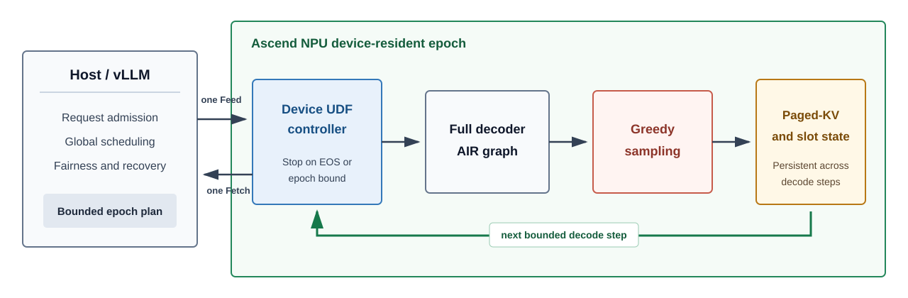

# Cruise

[简体中文](README.md) | **English**

**Eliminating per-token Host round trips with device-resident decode epochs.**

Cruise is a research prototype for Ascend NPUs that moves the
latency-sensitive inner loop of LLM decoding into a DataFlow Device UDF. The
Host still owns admission, global scheduling, fairness, and recovery. Once a
fixed batch has been admitted, the device can execute a bounded epoch of
decoder steps, update Paged-KV state, perform greedy sampling, and stop on EOS
or an epoch bound before returning to the Host.

The project explores a control boundary above single-graph replay: graph
execution removes per-operator launch overhead, while Cruise removes repeated
Host coordination between a bounded number of decode iterations.

> Cruise is an experimental systems prototype, not a production inference
> server. Its current support envelope is intentionally narrow and explicit.

## Architecture



The active implementation is the former **Attempt 74** snapshot. It provides:

- a vLLM V1 scheduler contract for fixed-shape resident epochs;
- a dedicated worker that leaves model and KV ownership with DataFlow;
- an EngineCore-to-native-sidecar path with one request/response per epoch;
- a B=4 full Qwen2.5-7B decoder step with device-side greedy sampling;
- stock-vLLM prefill followed by a one-shot, generation-checked Paged-KV import
  and an explicit Host-to-Device ownership transition;
- persistent Paged-KV state, active-row masks, block tables, slot mappings,
  row generations, and safe row reuse across epochs;
- bounded epoch lengths selected from K=1,2,4,8 within the request budget;
- EOS and maximum-step termination with per-request accounting returned to
  vLLM;
- pre-execution validation and input-preserving fallback status codes;
- a minimal 8-input/2-output Host-UDF ABI, reduced from the earlier 10/10
  boundary while retaining the internal 9-input/4-output decoder ABI;
- storage guards for bounded logs, marker-protected scratch, free-space
  admission, and cleanup.

The accepted multi-epoch cohort is `A -> [A,B] -> [A,C]`: request A retains its
row and KV state, B occupies a second row, and C safely reuses B's row with a
new generation. See [PROTOCOL.md](PROTOCOL.md) for the exact Attempt 74 gate.

## Current Evidence

The formal CANN 8.5.1 Attempt 74 run used `old -> new -> new -> old`, with 30
old and 30 new B=4/K=2 epochs. All 60 samples passed token, request-state,
call-count, and timing-window checks. The observed DataFlow API-boundary
payloads were:

| ABI | Feed/epoch | Fetch/epoch | Total/epoch |
|---|---:|---:|---:|
| old 10/10 | 58,720,516 B | 78,184,928 B | 136,905,444 B |
| new 8/2 | 260 B | 368 B | 628 B |

The reduction is 136,904,816 B per epoch. These values come from
`Tensor::GetSize()` on the actual `FeedDataFlowGraph` and
`FetchDataFlowGraph` tensors and exactly match the declared ledger; the
analyzer does not substitute declared constants for measured values.

Across the same 60 steady-state windows, the expanded tracer observed zero
calls to the covered `rtMemcpy`/`rtsMemcpy` APIs. All 1,745 runtime memcpy and
23 Mbuf records per process occurred during startup, outside measured epochs.
CANN 8.5.1 application `msprof` cannot initialize this resident sidecar, so
the DataFlow payload is **not** a measurement of PCIe, HCCS, or DMA link bytes.
Cruise makes no physical-link traffic reduction claim.

Across 30+30 samples, median Host-control wall time fell from 212.208 ms to
59.951 ms, or 3.54x; median Python CPU time fell from 2.368 ms to 1.045 ms, or
2.27x. See
[`evidence/ATTEMPT74-CANN851-R5.md`](evidence/ATTEMPT74-CANN851-R5.md) for the
complete result boundary and hashes. The earlier G4 K-sweep remains in
[`history/attempts/g4/G4-STATUS-20260724.md`](history/attempts/g4/G4-STATUS-20260724.md).

The first M1 ownership-transfer run used a three-token stock-vLLM prefill and
four greedy output tokens. Stock vLLM and Cruise both produced
`[2776, 4460, 311, 1855]`. The import epoch executed K=2 after matching Host
and Device Paged-KV checksums (`3477654769`), and the following Device-owned
K=1 epoch retained the 260-byte/368-byte steady ABI. See
[`evidence/M1-PREFILL-TRANSFER-20260729.md`](evidence/M1-PREFILL-TRANSFER-20260729.md).

## Support Boundary

The currently validated envelope is:

- Ascend 910B2 with the validated CANN 8.5.1/9.0.0 DataFlow Device UDF paths;
- Qwen2.5-7B-Instruct, TP=1, PP=1;
- synchronous vLLM V1 scheduling;
- one-token resident-only prompts and the qualified three-token prefill
  ownership-transfer case;
- one static B=4 graph with inactive-row masking;
- greedy sampling, bounded epochs, and a fixed two-block-per-row KV layout.

Cruise does not yet establish general prefill beyond that case, continuous batching, arbitrary
sampling, speculative decoding, preemption, cancellation, LoRA, TP/PP,
multi-card coordination, or API-server performance. These are research gates,
not hidden compatibility assumptions.

## Repository Layout

| Path | Purpose |
|---|---|
| `src/vllm_ascend_resident_epoch/` | vLLM scheduler, worker, contract, and backend integration |
| `controller/` | current Device UDF controller |
| `controller-old/` | old-ABI controller retained for controlled comparison |
| `native/` | sidecar, bridge, AIR relocation, and DataFlow/runtime tracing |
| `config/` | DataFlow and graph configuration templates |
| `tests/` | source-contract and integration unit tests |
| `storage_guard/` | root-space, scratch, log, and cleanup safeguards |
| `experiments/synthetic-p0/` | first synthetic feasibility experiment |
| `history/attempts/` | source-only snapshots of Attempts 41-73 and G4 development |
| `docs/` | project history and repository retention policy |
| `scripts/audit_repository.py` | large-file, artifact, hostname, and secret guard |

## Local Checks

The dependency-light contract and result-verifier suite does not require an
NPU, PyTorch, or vLLM:

```bash
python -m pip install pytest
python -m pytest -q \
  tests/test_abi_measurement.py \
  tests/test_contract.py \
  tests/test_engine_core_result_verifier.py \
  tests/test_multi_epoch_result_verifier.py \
  tests/test_productization_m0.py \
  tests/test_kv_transfer.py
python scripts/audit_repository.py
python verify_minimal_abi_source.py . \
  --baseline-source history/attempts/vllm-integration-attempt73-multi-epoch-cohort
```

This subset currently passes 51 tests, with one Torch-dependent test skipped.
The full server suite passes 73 tests and additionally requires the frozen
PyTorch, vLLM, and vLLM-Ascend environment; native execution
also requires the exact Ascend/DataFlow toolchain, decoder AIR, and external
weights used by the protocol. Generated models and measurements are
deliberately not stored in this repository.

## Reproducing the Hardware Gate

`run_attempt74.sh` is the versioned experiment driver. It starts from a clean
Git checkout, accepts machine-specific external asset paths through
`CRUISE_*` environment variables, stages generated artifacts below
marker-protected `/dev/shm` scratch, checks NPU and storage readiness, and
retains compact evidence with a SHA256 manifest. The formal CANN 8.5.1 run
automatically removed its scratch tree after finalization.

## Developer Preview Operations

The first Productization M0 increment introduces a machine-readable
compatibility matrix, strict JSON runtime configuration, and one CLI:

```bash
cruise smoke
cruise doctor --mode npu \
  --profile attempt74-910b2-cann851-r5 --device 7
cruise doctor --mode runtime --config /etc/cruise/cruise.json
```

See [INSTALLATION.md](docs/INSTALLATION.md),
[CONFIGURATION.md](docs/CONFIGURATION.md),
[OPERATIONS.md](docs/OPERATIONS.md), and
[COMPATIBILITY.md](docs/COMPATIBILITY.md) for installation, configuration,
lifecycle, and failure boundaries. These commands currently qualify the
Developer Preview and EngineCore path. A general API server remains an M1 gate
and is not claimed as available.

## Project History

The source archive records the progression from synthetic recurrence through
full-decoder execution and vLLM integration. A concise map is available in
[docs/PROJECT_HISTORY.md](docs/PROJECT_HISTORY.md). Historical snapshots are
preserved for provenance and are not active release branches.

Provisional paper title:

> **Cruise: Eliminating Per-Token Host Round Trips with Device-Resident Decode Epochs**
